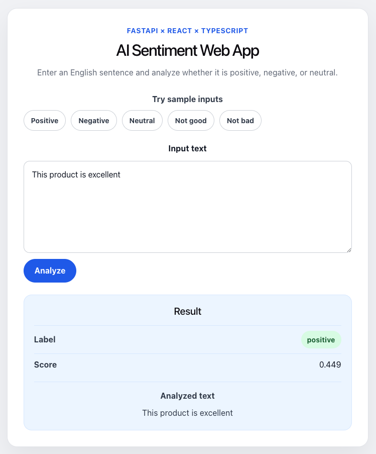

# AI Sentiment Web App

React + TypeScript のフロントエンドと FastAPI のバックエンドで作成した、シンプルな感情分析Webアプリです。

入力された英文テキストに対して、`positive` / `negative` / `neutral` のいずれかを判定し、スコアとともに画面に表示します。

## Demo

Cloud Runで公開しています。

```text
https://ai-sentiment-web-app-909882126486.asia-northeast1.run.app/
```

## Screenshot



## 概要

このプロジェクトは、React frontend を build し、その build 成果物を FastAPI backend から配信する一体型構成です。

```text
User
↓
Cloud Run
↓
FastAPI container
├── /             -> React画面
├── /assets/...   -> ReactのJS/CSS
├── /api/health   -> ヘルスチェックAPI
└── /api/predict  -> 感情分析API
```

Docker build の中で以下を行います。

```text
1. Node.js環境で React frontend を build
2. Python環境で FastAPI backend を用意
3. build済みの frontend/dist を FastAPIコンテナへコピー
4. 1つのコンテナで画面とAPIを配信
```

現在は、scikit-learnで学習した感情分析モデルを用いて、入力文を `positive` / `negative` / `neutral` に分類しています。

学習データは `data/sentiment_samples.csv` に配置し、`scripts/train_model.py` を実行することでモデルを再学習することができます。

## 使用技術

### Backend

* Python
* FastAPI
* Pydantic
* Uvicorn
* scikit-learn
* pandas
* joblib
* pytest
* httpx

### Frontend

* React
* TypeScript
* Vite
* Fetch API

### Infrastructure / DevOps

* Docker
* Docker Compose
* Cloud Run
* GitHub Actions

## 主な機能

* テキスト入力フォーム
* 感情分析APIの呼び出し
* 判定結果の画面表示
* ローディング状態の表示
* API通信失敗時のエラー表示
* 判定ラベルに応じたUI表示切り替え
* Pydanticによるリクエスト・レスポンスの型定義
* scikit-learnによる感情分析モデルの推論
* joblibによる学習済みモデルの保存・読み込み
* CSVデータを用いたモデル再学習
* train/test splitによる簡易的なモデル評価
* pytestによるBackendテスト
* GitHub Actionsによる自動テスト
* React build成果物のFastAPI配信
* multi-stage Docker build による一体型コンテナ作成
* Cloud Runへのデプロイ

## ディレクトリ構成

```text
ai-sentiment-api/
├── app/
│   ├── __init__.py
│   ├── main.py
│   ├── schemas.py
│   ├── models/
│   │   └── sentiment_model.joblib
│   └── services/
│       ├── __init__.py
│       └── predictor.py
├── data/
│   └── sentiment_samples.csv
├── scripts/
│   └── train_model.py
├── tests/
│   ├── test_api.py
│   └── test_predictor.py
├── frontend/
│   ├── src/
│   │   ├── App.tsx
│   │   └── App.css
│   ├── package.json
│   ├── package-lock.json
│   ├── tsconfig.json
│   └── vite.config.ts
├── .github/
│   └── workflows/
│       └── backend-test.yml
├── requirements.txt
├── pytest.ini
├── Dockerfile
├── docker-compose.yml
├── .gitignore
└── README.md
```

## アプリケーション構成

### `app/main.py`

FastAPIアプリケーションのエントリーポイントです。

主な役割：

* FastAPIアプリの作成
* APIエンドポイントの定義
* React build成果物の配信

定義している主なエンドポイント：

* `GET /api/health`
* `POST /api/predict`
* `GET /`
* `GET /{full_path:path}`

`GET /` および `GET /{full_path:path}` では、React build後の `frontend/dist/index.html` を返します。

### `app/schemas.py`

APIの入力・出力データ構造を定義しています。

* `PredictRequest`
* `PredictResponse`

### `app/services/predictor.py`

感情分析モデルを読み込み、推論を行う処理を定義しています。

主な役割：

* `app/models/sentiment_model.joblib` の読み込み
* 入力テキストの推論
* 予測ラベルとスコアの返却

FastAPI起動時に学習済みモデルを読み込み、リクエストごとにそのモデルを使って推論します。

### `app/models/sentiment_model.joblib`

scikit-learnで学習した感情分析モデルです。

このファイルには、以下が含まれます。

* `TfidfVectorizer`
* `LogisticRegression`
* scikit-learn `Pipeline`

### `scripts/train_model.py`

学習データを読み込み、scikit-learnモデルを学習・評価して保存するスクリプトです。

主な処理：

* `data/sentiment_samples.csv` の読み込み
* `text` と `label` の分離
* `TfidfVectorizer` による文章の数値化
* `LogisticRegression` による分類モデルの学習
* train/test splitによる簡易評価
* `classification_report` によるクラス別評価
* 全データでの最終モデル再学習
* `joblib` によるモデル保存

### `tests/test_predictor.py`

推論ロジックを直接テストするファイルです。

主な確認内容：

* positive文が `positive` と判定されるか
* `not good` が `negative` と判定されるか
* `not bad` が `positive` と判定されるか
* `predict_sentiment()` の返り値に `text` / `label` / `score` が含まれているか

### `tests/test_api.py`

FastAPIのAPIエンドポイントをテストするファイルです。

主な確認内容：

* `GET /api/health` が `200` を返すか
* `POST /api/predict` が正常なJSONを返すか
* 不正なリクエストボディに対して `422` が返るか

### `.github/workflows/backend-test.yml`

GitHub ActionsでBackendテストを自動実行する設定です。

主な処理：

* リポジトリのcheckout
* Pythonのセットアップ
* `requirements.txt` のインストール
* `pytest` の実行

Pull Requestやpush時に、主要なBackendテストが自動で実行されます。

## Machine Learning構成

このプロジェクトでは、scikit-learnを用いた感情分析モデルを使用しています。

### 学習データ

学習データは以下に配置しています。

```text
data/sentiment_samples.csv
```

CSVは以下の形式です。

```csv
text,label
I love this product,positive
This is terrible,negative
It is okay,neutral
```

否定表現への対応を改善するため、以下のようなデータも含めています。

```text
This is not good,negative
This is not great,negative
This is not bad,positive
The product is neither good nor bad,neutral
```

### 特徴量

文章の数値化には `TfidfVectorizer` を使用しています。

現在は、単語単体だけでなく2語のまとまりも特徴量として扱うため、以下の設定を使用しています。

```python
TfidfVectorizer(ngram_range=(1, 2))
```

これにより、以下のような違いを学習しやすくしています。

```text
good      -> positive寄り
not good  -> negative寄り

bad       -> negative寄り
not bad   -> positive寄り
```

### モデル評価

`scripts/train_model.py` では、モデル保存前に簡易的な評価を行います。

評価では、学習データを train / test に分割し、test データに対する予測結果から以下を表示します。

```text
Accuracy
Classification report
```

`classification_report` では、各クラスごとに以下を確認できます。

* precision
* recall
* f1-score
* support

現在のデータセットは小規模なサンプルデータであるため、評価値は安定しません。
そのため、現時点の評価は実用性能を正確に測るものではなく、モデル評価の流れを確認するためのものです。

評価後、APIで使用する最終モデルは、全データで再学習して `app/models/sentiment_model.joblib` に保存します。

### 再学習方法

ローカル環境で以下を実行します。

```bash
source .venv/bin/activate
pip install -r requirements.txt
python scripts/train_model.py
```

モデルが更新されたら、Dockerコンテナを再buildします。

```bash
docker compose up --build
```

## ローカルでの起動方法

### Dockerで起動する

プロジェクト直下で以下を実行します。

```bash
docker compose up --build
```

起動後、以下にアクセスします。

```text
http://127.0.0.1:8080
```

APIドキュメントは以下で確認できます。

```text
http://127.0.0.1:8080/docs
```

ヘルスチェックAPIは以下です。

```text
http://127.0.0.1:8080/api/health
```

## テスト

このプロジェクトでは、pytestを用いてBackendのテストを行っています。

### テスト実行方法

ローカル環境で以下を実行します。

```bash
source .venv/bin/activate
pip install -r requirements.txt
pytest
```

成功すると、以下のように表示されます。

```text
8 passed
```

### テスト内容

`tests/test_predictor.py` では、推論関数 `predict_sentiment()` を直接テストします。

主な確認項目：

* positive文の判定
* `not good` の判定
* `not bad` の判定
* 返り値の構造

`tests/test_api.py` では、FastAPIのエンドポイントをテストします。

主な確認項目：

* `GET /api/health`
* `POST /api/predict`
* 不正なリクエストに対する `422` レスポンス

## API仕様

### GET /api/health

ヘルスチェック用エンドポイントです。

レスポンス例：

```json
{
  "message": "Hello, FastAPI"
}
```

### POST /api/predict

感情分析を行うエンドポイントです。

リクエスト例：

```json
{
  "text": "This product is excellent"
}
```

レスポンス例：

```json
{
  "text": "This product is excellent",
  "label": "positive",
  "score": 0.9
}
```

## Cloud Runへのデプロイ

このアプリは、Cloud Runにデプロイできます。

Cloud Runでは、コンテナ化されたアプリケーションをGoogle Cloud上で実行できます。  
このプロジェクトでは、React frontendをbuildし、その成果物をFastAPI backendから配信する一体型Docker構成をCloud Runにデプロイしています。

### 前提条件

以下が完了している必要があります。

- Google Cloud CLIがインストールされている
- `gcloud init` が完了している
- Google Cloudプロジェクトが作成されている
- Billingが有効化されている
- 必要なAPIが有効化されている

### 使用するGoogle Cloudプロジェクトを確認する

```bash
gcloud config get-value project
```

このプロジェクトでは、以下のようなプロジェクトIDを使用します。

```text
sound-arcade-421503
```

### 必要なAPIを有効化する

```bash
gcloud services enable run.googleapis.com
gcloud services enable cloudbuild.googleapis.com
gcloud services enable artifactregistry.googleapis.com
```

### Cloud Run向けのポート設定

Cloud Runでは、コンテナが環境変数 `PORT` で指定されたポートで待ち受ける必要があります。

そのため、Dockerfileでは以下のようにUvicornを起動しています。

```dockerfile
CMD ["sh", "-c", "uvicorn app.main:app --host 0.0.0.0 --port ${PORT:-8080}"]
```

Cloud Run上では `PORT` 環境変数が使われ、ローカルではデフォルトで `8080` が使われます。

### ローカルでCloud Run想定の動作確認をする

```bash
docker compose up --build
```

起動後、以下にアクセスします。

```text
http://127.0.0.1:8080
```

ヘルスチェックAPIは以下です。

```text
http://127.0.0.1:8080/api/health
```

### 手動デプロイ

プロジェクト直下で以下を実行します。

```bash
gcloud run deploy ai-sentiment-web-app \
  --source . \
  --region asia-northeast1 \
  --allow-unauthenticated \
  --min-instances 0
  --max-instances 3
```

このコマンドでは、ローカルのソースコードをGoogle Cloudに送信し、Cloud Buildでコンテナイメージをbuildして、Cloud Runにデプロイします。

Cloud Runのソースデプロイでは、`gcloud run deploy --source` により、ソースコードからCloud Runサービスを作成・更新できます。

### オプションの意味

```text
ai-sentiment-web-app
```

Cloud Run上のサービス名です。

```text
--source .
```

現在のディレクトリをソースとしてデプロイします。

```text
--region asia-northeast1
```

東京リージョンにデプロイします。

```text
--allow-unauthenticated
```

ログインなしで誰でもアクセスできるURLとして公開します。

```text
--min-instances 0
--max-instances 3
```

アクセスがないときはインスタンス数を0にして、コストを抑えます。

### デプロイ後の確認

デプロイが成功すると、以下のようなURLが表示されます。

```text
https://ai-sentiment-web-app-xxxxx-an.a.run.app
```

以下を確認します。

```text
https://<cloud-run-service-url>/
https://<cloud-run-service-url>/api/health
```

### ログ確認

Cloud Runのログは以下で確認できます。

```bash
gcloud run services logs read ai-sentiment-web-app \
  --region asia-northeast1
```

### 注意点

Cloud Runには無料枠がありますが、完全無料が保証されるわけではありません。  
Cloud Build、Artifact Registry、ログ保存、ネットワーク転送などで料金が発生する可能性があります。

学習用では、以下の設定を推奨します。

- `--min-instances 0` を指定する
- `--max-instances 3` を指定する
- Google Cloud Billingで予算アラートを設定する
- 使わないサービスは停止・削除する

## CI/CD

このプロジェクトでは、GitHub Actionsを用いてBackendテストとCloud Runへの自動デプロイを行っています。

### Backend Tests

Backendのテストは、以下のworkflowで実行されます。

```text
.github/workflows/backend-test.yml
```

このworkflowでは、pushやPull Request作成時に以下を実行します。

```text
1. リポジトリをcheckoutする
2. Pythonをセットアップする
3. requirements.txt をインストールする
4. pytest を実行する
```

これにより、`main` に壊れたコードが入ることを防ぎやすくしています。

### Cloud Run Auto Deploy

Cloud Runへの自動デプロイは、以下のworkflowで実行されます。

```text
.github/workflows/deploy-cloud-run.yml
```

このworkflowでは、`main` にpushされたときに以下を実行します。

```text
1. リポジトリをcheckoutする
2. Pythonをセットアップする
3. requirements.txt をインストールする
4. pytest を実行する
5. Google Cloudに認証する
6. Cloud Runへデプロイする
```

テストが失敗した場合、Cloud Runへのデプロイは実行されません。

### GitHub Actions Variables

Cloud Runデプロイに必要な設定値は、workflowファイルに直接書かず、GitHub ActionsのRepository Variablesとして管理しています。

使用している主なVariablesは以下です。

```text
GCP_PROJECT_ID
GCP_REGION
CLOUD_RUN_SERVICE
GCP_WORKLOAD_IDENTITY_PROVIDER
GCP_SERVICE_ACCOUNT
```

これにより、プロジェクトIDやリージョン、Cloud Runサービス名をworkflowファイルの変更なしで調整しやすくしています。

### Google Cloud Authentication

GitHub ActionsからGoogle Cloudへの認証には、Workload Identity Federationを使用しています。

これにより、サービスアカウントキーJSONをGitHub Secretsに保存せずに、GitHub ActionsからGoogle Cloudへ安全に認証できます。

このプロジェクトでは、GitHub Actions用のサービスアカウントを作成し、そのサービスアカウントにCloud Runデプロイに必要な権限を付与しています。

### Deployment Flow

全体の流れは以下です。

```text
feature branch
↓
Pull Request
↓
Backend Tests
↓
merge to main
↓
Deploy to Cloud Run workflow
↓
pytest
↓
Cloud Run deploy
↓
public URL updated
```

この構成により、`main` にマージされた内容が自動的にCloud Runへ反映されます。

### Node.js Runtime for GitHub Actions

GitHub ActionsのJavaScript Action実行環境では、Node.js 20の非推奨化に対応するため、以下の環境変数を設定しています。

```yaml
FORCE_JAVASCRIPT_ACTIONS_TO_NODE24: true
```

これにより、GitHub ActionsのJavaScript ActionをNode.js 24実行環境に寄せています。


## FrontendとAPIの通信

React側では、APIを相対パスで呼び出しています。

```ts
fetch("/api/predict", ...)
```

一体型構成では、React画面とAPIが同じオリジンから提供されます。

```text
https://<cloud-run-service-url>
```

そのため、本番想定の一体型構成ではCORS問題は基本的に発生しません。

## Docker構成

このプロジェクトでは、multi-stage build を使用しています。

### 1. Frontend build stage

Node.js環境でReactをbuildします。

```text
frontend/src
↓
npm run build
↓
frontend/dist
```

### 2. Backend runtime stage

Python環境でFastAPIを起動します。

Frontend build stageで生成した `frontend/dist` をFastAPIコンテナへコピーし、FastAPIから静的ファイルとして配信します。

最終的なコンテナには以下が含まれます。

```text
/app
├── app/
│   ├── main.py
│   ├── schemas.py
│   ├── services/
│   └── models/
└── frontend/
    └── dist/
        ├── index.html
        └── assets/
```

## 開発時にFrontendとBackendを分けて起動する場合

開発中にReactのHot Reloadを使いたい場合は、FrontendとBackendを別々に起動できます。

### Backend

```bash
uvicorn app.main:app --reload
```

Backendは以下で起動します。

```text
http://127.0.0.1:8000
```

### Frontend

別ターミナルで以下を実行します。

```bash
cd frontend
npm install
npm run dev
```

Frontendは以下で起動します。

```text
http://localhost:5173
```

この開発時構成では、FrontendとBackendが別オリジンになるため、FastAPI側のCORS設定が必要になります。

## 注意事項

### `npm run dev` と `npm run build` の違い

`npm run dev` は開発用サーバーを起動するコマンドです。

```text
http://localhost:5173
```

でReactアプリを確認できます。

一方、`npm run build` は本番用の静的ファイルを生成するコマンドです。

```text
frontend/dist/
```

が生成されます。

このプロジェクトのDockerfileでは、Docker build中に `npm run build` を実行し、生成された `frontend/dist` をFastAPIコンテナへコピーします。

### scikit-learnモデルの制限

現在のモデルは、小規模なサンプルデータを用いた学習モデルです。

そのため、実用的な精度には達していません。

特に、以下のような否定表現では誤分類する可能性があります。

```text
not good
not great
not bad
not terrible
```

これは、学習データが少ない場合や、単語単体の特徴量に強く反応する場合に起きます。

## 現在の制限

* 学習データが小規模であり、実用的な精度には達していません
* 英文テキストのみを想定しています
* 否定表現は一部改善していますが、複雑な文脈理解はできません
* 未知語や長文に対する予測は不安定です
* 評価データも小規模であるため、評価指標は安定しません
* Frontendのbuild成果物 `frontend/dist/` はGit管理していません

## 今後の改善案

* 学習データの追加
* より大きな公開データセットの利用
* モデル比較
* 日本語テキストへの対応
* Backendテストの拡充
* VitestなどによるFrontendテスト追加
* UI/UX改善

